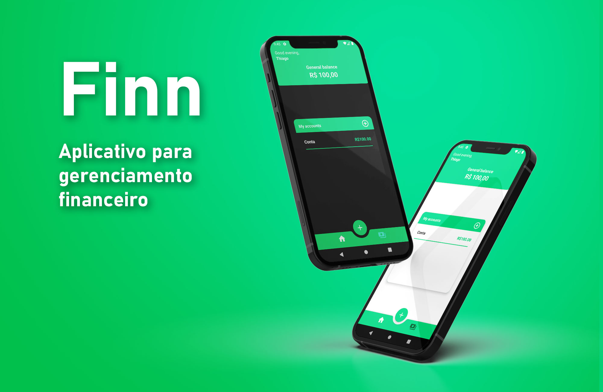

# Finn

  <a href="#-tecnologias">Tecnologias</a>&nbsp;&nbsp;&nbsp;|&nbsp;&nbsp;&nbsp;
  <a href="#-projeto">Projeto</a>&nbsp;&nbsp;&nbsp;|&nbsp;&nbsp;&nbsp;
  <a href="#-download">Download</a>&nbsp;&nbsp;&nbsp;|&nbsp;&nbsp;&nbsp;
  <a href="#memo-licença">Licença</a>

  

 

## 🚀 Tecnologias

Esse projeto utilizei as seguintes tecnologias:

- Kotlin
- ROOM
- LiveData
- Arquitetura MVVM

## 📱 Projeto

Projeto criado com o intuito de colocar em prática os meus conhecimentos sobre desenvolvimento
Android nativo. Finn é um aplicativo para gerenciamento financeiro, nele você pode adicionar suas
contas, adicionar suas receitas e despesas e controlar sua vida financeira com muito mais
facilidade, tendo todo o histórico das suas finanças e visualização dos próximos meses

## Download

Projeto em desenvolvimento...
Assim que finalizado o download será disponibilizado

## :memo: Licença

Esse projeto está sob a licença MIT.

---

Desenvolvido por Thiago Ferreira :wave: